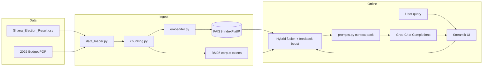

# Architecture — Academic City RAG (2026)

**Student:** Denzel Nyarko  
**Index:** 10022300153  

## System overview

## Data flow (end-to-end)

1. **Ingestion (offline):** CSV rows are cleaned and linearised to text; the PDF is extracted with PyMuPDF.  
2. **Chunking:** Either **sentence-bounded** windows (default) or **fixed** character windows — both strategies can be indexed side-by-side for comparison (`data/index/sentence`, `data/index/fixed`).  
3. **Embeddings:** `sentence-transformers/all-MiniLM-L6-v2` encodes each chunk; vectors are **L2-normalised** so inner product equals cosine similarity.  
4. **Vector storage:** FAISS `IndexFlatIP` stores dense vectors; chunk metadata is serialised to JSON alongside the index.  
5. **Retrieval:** Top-k dense hits are fused with BM25 keyword scores (`rank-bm25`). Optional per-chunk **feedback multipliers** (innovation) adjust the hybrid score.  
6. **Context selection:** Chunks are greedily packed up to `MAX_CONTEXT_CHARS`, highest rank first.  
7. **Prompting:** System + user templates enforce **grounding** and **hallucination control** (variants in `src/prompts.py`).  
8. **Generation:** Direct Groq HTTP client (`groq` SDK) — no orchestration framework.  
9. **Logging:** Each stage is captured in-memory and appended to `logs/rag_runs.jsonl`.

## Why this fits Academic City + Ghana policy/elections

- **Hybrid retrieval** helps when users type **named entities** (regions, ministries) where BM25 excels, while dense retrieval carries **paraphrases** and conceptual questions about fiscal policy.  
- **Sentence-aware chunking** keeps table-adjacent narrative and numbered policy lists more coherent than arbitrary character cuts, reducing “half a bullet” fragments in answers.  
- **Strict prompt variants** support course-style evaluation: you can show how grounding instructions change hallucination rates in your manual logs.

## Components interaction (short)

| Component | Responsibility |
|-----------|----------------|
| `data_loader.py` | Cleaning + canonical text extraction |
| `chunking.py` | Deterministic chunk IDs, two strategies |
| `embedder.py` | Local embedding batching |
| `vector_store.py` | FAISS persistence |
| `retrieval.py` | Top-k, similarity, hybrid + feedback |
| `prompts.py` | Templates + context packing |
| `rag_pipeline.py` | Orchestration + JSONL logging |
| `streamlit_app.py` | UI + transparency (scores, prompt) |
